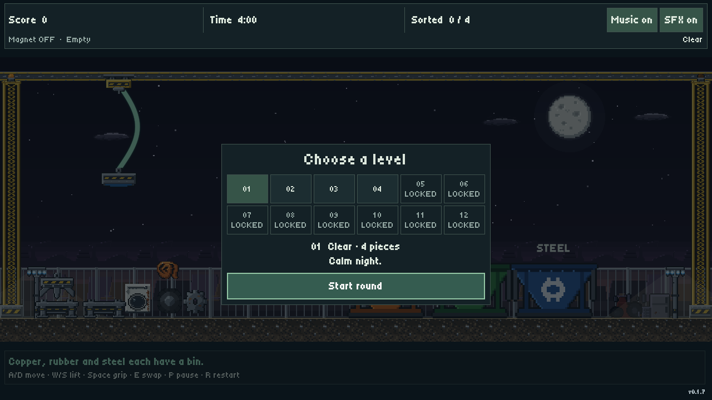

# Pocket Salvage

A four-minute scrapyard shift. Drive a swinging crane, swap between a magnet and a claw, and sort scrap before time runs out.

**[Play in your browser](https://pocket-salvage.web.app/)** · **[Download for Windows or Linux](https://github.com/RaresKeY/pocket-salvage/releases/latest)** · [GitHub Pages mirror](https://rareskey.github.io/pocket-salvage/)

## Play

The **magnet lifts steel**; the **claw grabs copper and rubber**. Park your head at an empty tool stand on the left, then pick up the other. Drop scrap into its matching bin.

Correct sorts earn **100 points**. A wrong bin throws the item back and costs **25 points**. Clear the yard early for **5 points per second remaining**. Weather can push the crane, make scrap slippery and briefly cut magnet power; harder weather multiplies a positive final score.

| Action | Keyboard | Controller |
|---|---|---|
| Start / resume / replay | Enter or on-screen button | A / south face button |
| Move / raise / lower | WASD or arrows | Left stick or D-pad |
| Grab / release | Space | A / south face button |
| Park / pick up a head | E | X / west face button |
| Pause / resume | P or Escape | Start or B / east face button |
| Restart | R | Y / north face button |
| Toggle music / SFX | M for music; HUD buttons | Left / right bumper |

**Audio:** click Start to enable browser audio. Music and SFX have separate mute buttons and pause-menu volume sliders.

**Mobile:** Web builds automatically show bottom-right touch controls. Hold the arrows to move and lift; tap Grip or Swap. Landscape gives the yard more room.

**Desktop:** extract the whole ZIP and keep the executable beside its PCK file. Run `pocket-salvage.exe` on Windows or `pocket-salvage.x86_64` on Linux. The downloadable Web ZIP needs an HTTP server; the hosted links are ready to play.

## Levels on main

The source version adds a classic 12-slot grid, with four levels unlocked:

| Level | Pieces | Weather |
|---|---|---|
| 01 · Clear | 4 | No weather effects |
| 02 · Breezy | 6 | Light wind, rain, fog and occasional lightning |
| 03 · Violent | 10 | Strong gusts, heavy rain and frequent lightning |
| 04 · Blood Moon | 12 | Crimson sky, reversed heads, generator failures and shifting mild-to-medium weather |

Blood Moon reverses the tools: the magnet lifts copper/rubber and the claw lifts steel. Wind changes sides smoothly; generator outages disable the claw briefly. Only crows inhabit the cursed yard.

The other eight slots are locked placeholders. The game opens on this grid. Clear a level to see **Victory**, then **Continue** back to selection with the next playable level highlighted. Timeout offers **Retry** or **Levels**. Explicit restart keeps the same level. Select a tile with mouse/touch, or choose with controller directions and press A to start.

**Published version: [v0.1.7](https://github.com/RaresKeY/pocket-salvage/releases/tag/v0.1.7).** Both hosted sites currently run v0.1.7, which rolls weather per round and does not yet include the level grid. The screenshots above show current source. Firebase is updated manually; GitHub Pages updates with tagged releases.

## Development

Made with **Godot 4.7**. Import `project.godot` and run: level selection opens immediately. The playable scene is `labs/salvage/lab.tscn`.

On Linux, `./play.sh` launches current local source with desktop audio (including uncommitted edits, with no fetching) and `./tests/check` runs the suite. Both require the shared `godot-podman` runner; the launcher also needs a PulseAudio-compatible desktop audio socket. See the setup and alternative commands below.

- [Contributor guide](docs/collaboration.md) and [test guide](tests/README.md).
- [Specs](specs/_readme.md) and [design](design/_readme.md) — behavior, decisions and human/AI attribution.
- [Builds and releases](specs/builds.md) — exports, checksums, tag automation and hosting.
- [Performance review](docs/performance-review.md) — Firefox/Linux measurements and limitations.

Main pushes run tests. Matching version tags test and build Windows, Linux and Web releases, then update GitHub Pages. Linux and Firefox/Linux have runtime validation. Windows exports are built and hash-verified; a Windows-machine playtest is still pending.
