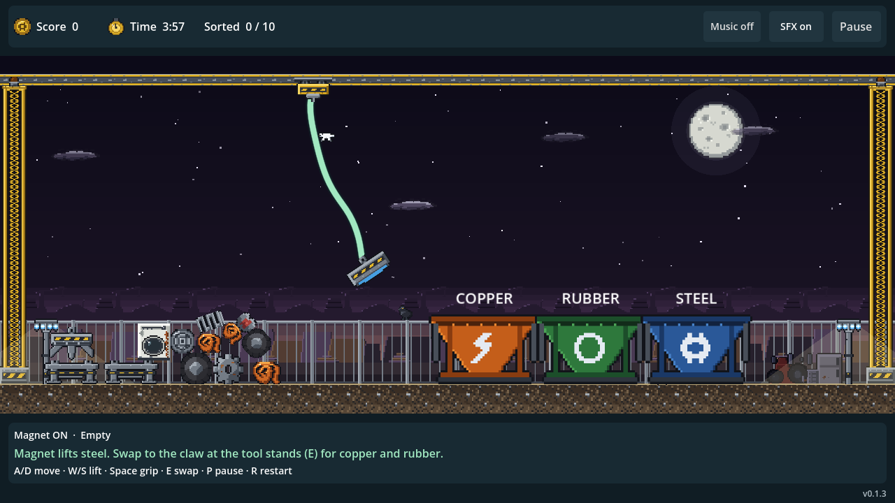

# Pocket Salvage

A four-minute scrapyard shift. Drive a swinging crane, swap between a magnet and a claw, and sort ten pieces of scrap before time runs out.

**[Play in your browser](https://rareskey.github.io/pocket-salvage/)** · **[Download for Windows or Linux](https://github.com/RaresKeY/pocket-salvage/releases/latest)**

## How to play

The **magnet lifts steel**; the **claw grabs copper and rubber**. Park your current head at an empty tool stand on the left, then pick up the other. Drop scrap into its matching bin.

Correct sorts earn **100 points**. A wrong bin throws the item back and costs **25 points**. Clear the yard early for **5 points per second remaining**.

| Action | Keyboard | Controller (standard layout) |
|---|---|---|
| Start / resume / replay | Enter or the on-screen button | A / south face button |
| Move / raise / lower | WASD or arrow keys | Left stick or D-pad |
| Grab / release | Space | A / south face button |
| Park / pick up a head | E | X / west face button |
| Pause / resume | P or Escape | Start or B / east face button |
| Restart | R | Y / north face button |
| Toggle music / SFX | M for music; HUD buttons | Left / right bumper |

On mobile Web browsers, a **bottom-right touch controller** appears automatically: hold arrows to move and lift; tap **Grip** or **Swap**. You can use movement and action buttons together. Turn your phone sideways for a wider yard. Start, pause, resume and audio controls remain on-screen.

For desktop downloads, extract the whole ZIP and keep the executable beside its PCK file.

## Development

Made with **Godot 4.7**. Open `project.godot` and choose **Play prototype** from the yard preview. On a workstation configured with the shared Godot runner, `./play.sh` launches the game with desktop audio and `./tests/check` runs the test suite.

- [Contributor guide](docs/collaboration.md) — setup, direct-main workflow, and migration from `random-game`.
- [Specs](specs/_readme.md) and [design](design/_readme.md) — current behavior, decisions, and human/AI attribution.
- [Builds and releases](specs/builds.md) — local exports, checksums, tag automation, and platform validation.

Main pushes run tests. Matching version tags test and build Windows, Linux and Web releases, then update the playable site. Windows exports are built and checked but still need a Windows-machine playtest.
